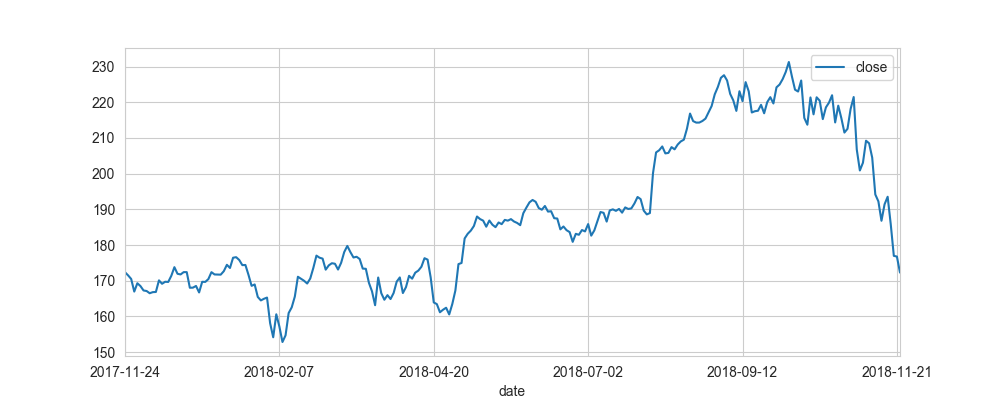
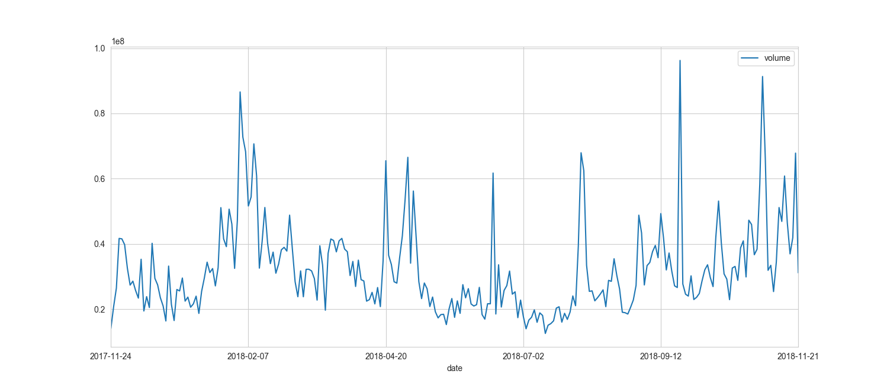
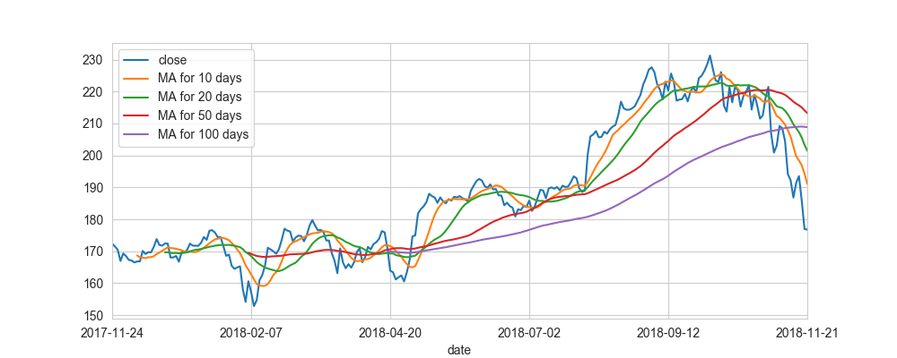
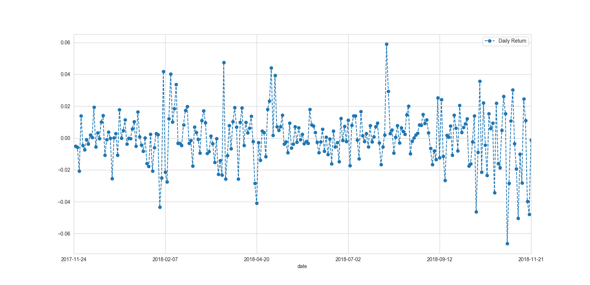
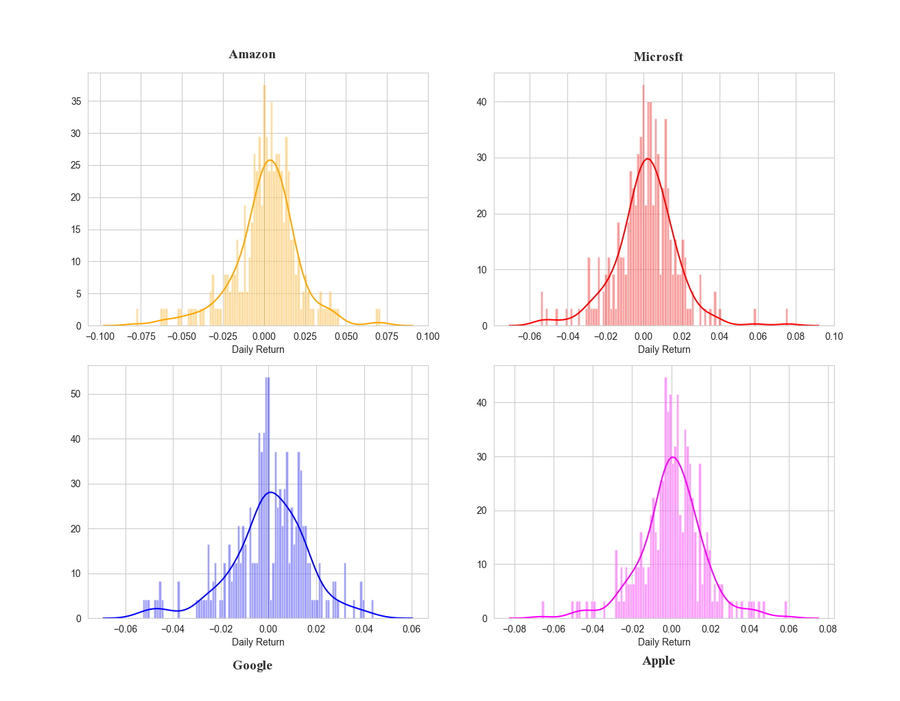
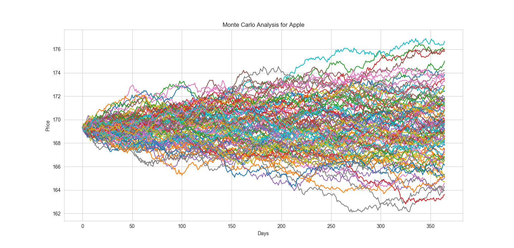

Stock Trend Prediction Based on Historical Data

Research Proposal
=================

Introduction and Motivation
---------------------------

The goal of this paper is to experiment with multiple different
predicting technical indicators and factors to find out the essential
factors affecting the stock change and forecast the future stock trend
based on collected stock dataset. It also investigates the correlation
between stocks and tries to evaluate the risk of stocks.\

Stock trend prediction has been a classic but significantly challenging
prediction problem for a very long time. For one hand, the market itself
is highly stochastic. Stock prices are largely driven by new
information, resulting in a random-walk pattern @malkiel1985random. On
the other hand, there are a significant number of complicated financial
indicators, but very few people are able to understand the meaning of
these indicators, and the correlation among them, and even fewer people
are able to manipulate with them to finally make accurate predictions of
the stock price. However, with the recent development in technology,
specially the advancement in big data area, there are more and more
successful cases to make very accurate future predictions based on good
analysis on historical dataset. We hope to combine the quantitative and
qualitative methods to look deeply into multiple financial indicators,
understand the connections with them, spot the most informative
indicators, and finally make better predictions. Additionally, by
experimenting with a number of prediction models, we can gain insight
about market behavior over time, spotting trends that would otherwise
not have been noticed.

Proposed Method, Data Sources, Applications, and Research Methods
-----------------------------------------------------------------

The proposed data sources, experiment process, and research methods are
listed below:

1.  Collect and clean historical data: this step involves collecting the
    data from data sources.

2.  Preprocess: this step involves preprocessing the data into
    structured format and selecting the most meaningful from them.

3.  Build models: this step involves selecting appropriate models or
    features, designing specific framework using specific metric to
    trigger the trade decision.

4.  Backtest: this step involves testing the performance of the
    methodology.

5.  Compare the models: this step involves comparing the performance of
    each model, and analyzing the factors resulting in the difference in
    order to find out the important features.

6.  Acquire current data: this step involves collecting current
    real-time data for future predictions.

7.  Generate predictions from current data.

There are a number of public stock dataset on the internet, including
Nasdaq, QuantQuote minute resolution data files, Google Finance, Yahoo
Finance, S&P 500, etc. Due to different data sources, we used Python
together with No-Sql database (e.g. MongoDB) to preprocess the dataset
into pre-defined structured format, and saved them into database for
efficient retrieval. For building the framework and analysis, Python was
used, and data visualization was done via Tableau, d3, Pandas, and
Matlabplot library.

Proposed Interviewees
---------------------

The target interview group includes experts from industry such as hedge
manager, related professors from economics and business.

Literature Review and Problem Analysis
======================================

History of the Problem
----------------------

The stock of a company is constituted of the equity stock of its owners.
Each piece of stock is a tiny share of ownership. The more the share is,
the more dividends will be earned when the company makes profits. The
accurate forecasting of a stock’s future price could yield significant
profits. Due to this economic incentive, stock trend prediction, or more
specifically stock price prediction, has been constantly appealing for
investors and researchers. Although there have be a significant effort
made to this area, no particular effective method has been found to
accurately forecast stock trend changes. The difficulty of the problem
lies in the intricacies of modeling market dynamics @rajput2016stock.
Despite the difficulty, there have been some successes, and this paper
will base on these successful research to further investigate into stock
trend prediction.

The Efficient Markets Hypothesis and the Random Walk
----------------------------------------------------

The efficient market hypothesis (EMH) @malkiel1989efficient is a finance
theory states that all available information is the reflection of the
asset prices. It indicates that stock prices are a combination of
information and rational expectations. This implies that current price
of the stock would reflect all public information about a company
including its price history. A direct implication is that it is hardly
possible to win the market on a risk-adjusted basis due to the fact that
market prices should only be responsive to new information. As a result,
changes in the stock price is the reflection of new information, changes
in the market generally, or random movements around the value that
reflects the existing information set. Burton asserted that simply based
on price history, stock prices can not be accurately forecasted
@malkiel1985random. Accordingly, he argued that a “random walk” is the
best description of the nature of changes in the stock prices, which
means that every deviation from the central value is accidental and
unpredictable. This led to an unintuitive conclusion that it actually
hurts the net portfolio return to predict the market. After many
empirical tests, it turns out that most portfolios managed by
professional stock predictors cannot be better than the market average
return after considering the managers’ fees, which supports this theory.
Due to this contradict nature of the stock prediction, there have been a
long-term debate over the effectiveness of stock price prediction.

Prediction Methods
------------------

Stock trend or stock price prediction research follows two essential
trading philosophies: fundamental and technical approaches. Recently,
there merges a new approach: Machine Learning. In this case, prediction
methodologies fall into three categories, which are fundamental
analysis, technical analysis (charting) and machine learning.

### Fundamental Analysis

In Fundamental analysis, the focus is on the company owning the stock
itself. Fundamentalists use numeric data such as company’s past
performance including earnings, ratios, and management effectiveness to
determine future forecasts. Comparing with the bottom-up company
analysis, it is a top-down analysis. It starts with first analyzing the
global economy, then analyzing the country and then sector, and finally
ends with the company level analysis. Among the fundamental analysts,
Warren Buffett is the most famous for the public.\

Fundamental analysis is based on the assumption that capital is
necessary for the human society to make progress and it should be
rewarded and lead to an increase in stock price if a company run well, .
As it is the most reasonable, and the data is uses is all publically
accessible, fundamental analysis is widely used by fund managers.

### Technical analysis

In Technical analysis, the focus is on the market timing, rather than
anything related to the company. It utilize charts and modeling
techniques to identify patterns and trends in price and volume. Together
with the patterns, techniques such as the exponential moving average
(EMA) are often used. Candle stick patterns @morris2006candlestick are
now frequently used by the researchers. In this paper, this is the main
methodology being followed.

### Machine Learning

With the advent of the computing, there have been an increasing effort
devoted to make use of computational power to predict the stock price.
The most outstanding technique includes the use of artificial neural
networks (ANNs) and Genetic Algorithms(GA). An ANN is capable of working
parallel with input variables and consequently handle large sets of data
swiftly. The principal strength of an ANN is its ability to find
patterns and irregularities as well as detecting multi-dimensional
non-linear connections in data. The latter capability of ANN is
extremely useful for modeling dynamical systems e.g., stock market
@dase2010application. ANNs can be regarded as mathematical function
approximators. The feed forward network together with the backward
propagation is the most common form of ANN used in stock market
prediction. Another form of ANN that is more appropriate for stock
prediction is the time recurrent neural network (RNN) or time delay
neural network (TDNN) @wikipedia_2018.\

Youngohc Yoon and George Swales in 1991 demonstrated that the neural
network approach is able to learn a function from chaotic dataset and
compared with Multivariate Discriminant Analysis approach, the neural
network approach can significantly improve the performance of stock
price @yoon1991predicting. Saeed Moshiri in 2000 compared the
performance of ANN model with the traditional economic approaches to
predicting the inflation rate and it was shown that the hybrid ANN
models are able to predict as well as the traditional approach
@moshiri2000neural. Erdinc Altay in 2005 used the ANN model to predict
the Istanbul Stock exchange and compared the performance of ANN with
linear regression and buy and hold strategies @altay2005stock. Heping
Pan in 2005 investigated into feature selection of ANN models and
adjusted the number of hidden neurons to forecast Australian stock
market @pan2005predicting. M.A.Mammadov in 2009 modified the typical ANN
algorithm to predict stock market indices @tilakaratne2009modified. E.L.
de Faria in 2009 performed a forecast of the Brazilian stock market
using ANN models and the adaptive exponential smoothing method, and
compared and evaluated the performance of both methods on this market
index @de2009predicting. Qing Cao in 2009 tested the forecast ability of
several well-established forecasting models, including dynamic versions
of a single factor CAPM-based model and Fema and French’s three-factor
model, compared these models with ANN models, and found that there is no
statistical difference in the forecasting accuracy among them and also
found that ANN may perform better for stock price prediction in emerging
markets @cao2011three. Monica Isfan in 2010 showed that the ANN model
have the ability of uncovering the nonlinearity among the financial
data, and compared the ANN model with the traditional approach based on
the Portuguese Stock market data @isfan2010forecasting.\

In terms of the stock forecast with ANN models, there are two common
approaches to predicting different time horizons: independent and joint.
In most cases, the independent approach often uses a single ANN for each
time horizon, for example, 2-day, one-week, or one-month. The strength
of this approach is that error for one horizon will not impact another
horizon because the way it builds the model treats each time horizon
separately and regards each as an unique problem. The joint approach, on
the other hand, incorporates multiple time horizons together so that
they are determined simultaneously. Consequently, forecasting error for
one time horizon may have influence on another horizon, which may
compromise the performance. Compared with the independent model, more
parameters needed for the joint model, and thus the risk of overfitting
is increased @wikipedia_2018.\

In recently years, the majority of researchers who study ANN models for
stock prediction seem to be using an ensemble of serveral ANN methods
more frequently and some of them are successful @wikipedia_2018. A major
finding with ANN models and stock price forecast is that a binary
classification approach with buy and sell as two output classes results
in better predictive reliability than a quantitative output such as low
or high price @thawornwong2004forecasting.

Data sources for prediction
---------------------------

Expect for the historical stock dataset itself, there are a number of
other data sources that can be used to research, including company data,
social media data, public search data, etc. Tobias Preis et al. in 2013
used trading strategies based on search data from Google Trends to
identify online precursors for stock market moves @ball2013counting.
Their analysis of Google search volume for 98 terms of varying financial
relevance suggested that increases in search volume for financially
relevant search terms tend to precede large losses in financial markets
@preis2013quantifying @bilton2013google @matthews2013trouble
@ball2013counting @palmer2013google.\

In a study published in Scientific Reports in 2013, it is found that
there is a correlation between subsequent large stock market moves and
changes in the number of views of Wikipedia articles of financial topics
@moat2013quantifying.\

Khadjeh Nassirtoussi in 2014 pointed out that the use of Text Mining
received more attention in the last years, with the use of textual
content from Internet as input to predict price changes in stocks and
other financial markets @nassirtoussi2014text.\

The sentiment or mood analysis of Twitter messages has been used to
predict stock market. Xiaojun Zeng in 2010 incorporated the specific
public mood dimension to improve the accuracy of Dow Jones Industrial
Average (DJIA) predictions @bollen2011twitter.\

Beckmann in his Phd thesis used the enterprise headlines from Yahoo!
Finance and Google Finance as news feeding in a test mining process, to
forecast the stock price movements from Dow Jones Industrial Average
@beckmann2017stock.\

As shown above, with the advert advance in information and media
industry, there are a significant number of diverse data sources for
stock prediction now.

Datasets
--------

Nowadays, there are a large number of public stock dataset on the
internet, including Nasdaq, Google Finance, Yahoo Finance, S&P 500, etc.
Based on these public data sources, there are some good quality
structured dataset for stock market prediction. Stocknet-dataset
@xu2018stock is a comprehensive dataset for stock movement prediction
from tweets and historical stock prices. It includes two-year price
movements from 01/01/2014 to 01/01/2016 of 88 stocks coming from all the
8 stocks in the Conglomerates sector and the top 10 stocks in capital
size in each of the other 8 sectors.

Experiment Design
=================

After thorough literature review and background study, it is time to
look at the dataset and dig deeper into them. For the experiment, it
will start with the dataset itself, looking at the statistics, figuring
out what are they, what are the details of each dataset and features,
what are the relationships between each dataset and features, and figure
out how these features will affect trading decision. For this section,
firstly, some common technical indicators will be investigated. Then,
some essential experiment questions will be proposed and detailed
analysis will be followed trying to answer them one by one in the
following sections.\

The goal of the experiment is not to study each technical indicator, but
to investigate how to use them, and the effectiveness of each one when
used for triggering the trade decision. These technical indicators have
been massively used in stock analysis for a long time, and there have
been massive research conducted to support its correctness. Due to the
length limitation of this paper, the work to show that how each
indicator relates to the stock price change is omitted, and the focus is
put onto how to use them to make the trade decision.\

With regard to the specific research approach, the paper mainly follows
the quantitative methodology paradigm. After detailed background
research, some research problems are proposed. These research problems
aim at specifying the direction of the experiments, and the goals or the
final outcome the experiments attempting to achieve. Hypothesis testing
is not used here as it does not suitable for the problems this paper
tries to solve. Then, based on the proposed research problems, detailed
experiment and analysis is conducted, and finally valuable observations
or outcome is summarized and concluded in the end of the experiments.

Technical Indicators
--------------------

For each stock, at any time, it has four different types of prices,
including low price, high price, open price and close price. These four
different types of prices are called tick price of the stock. Technical
indicators are the characteristics of the stock calculated based on its
tick price. Some commonly used technical indicators are as follows.

### Moving Average (MA)

Moving average is only based on the close price of each stock. The other
prices including high price, low price, and open price have nothing to
do with this indictor. It is calculated based on a specific period of
time, such as an hour, a week, a month, etc. There are many benefits to
analyze the moving average during trading. First, it can help filter out
the “noise” of a stock price. The MA gives a general direction of the
stock is moving, so it is easy to detect any outlier based on MA.
Second, it can act as a support for an uptrend, and as a resistance for
a downtrend. There are various types of MA, and one type is useful under
one condition and the other type may be useful for another task. The key
here is the time period for calculating the MA.\

Although MA is very easy and straightforward, it is extremely useful.
However, it has some inevitable disadvantages. Firstly, due to the fact
that it is calculated based on historical day, it does not have any
predication in nature. As a result, using MA can lead to some random
results. It might work very well in a strong trending condition but very
bad in a fluctuating condition.

### Simple Moving Average (SMA)

The simple moving average (SMA) is the sum of the most recent daily
close prices divided by the number of days. It is used to create a new
average every day, and thus each average is connected to the next,
creating the singular flowing line.

#### Experiment question 1

What is the simple moving average (SMA) of each stock? How does it
relate to making the trade decision?

### Exponential Moving Average (EMA)

Another commonly used type of MA is the so-called exponential moving
average (EMA). Compared with SMA, it is slightly more complicated. The
key idea is that EMA gives more weight to the most recent prices. It is
often the case that the EMA responses more sensitively to changes in
price than the SMA does.

#### Experiment question 2

What is the exponential moving average (EMA) of each stock? How does it
relate to making the trade decision?

### Moving Average Convergence Divergence (MACD)

Moving Average Convergence Divergence (MACD) is an indicator which
demonstrates the relationship between two Mas of prices. It is
calculated by subtracting the 26-day EMA from the 12-day EMA. Then, a
9-day EMA is plotted on top of the MACD, serving as a so-called “signal
line”. This signal line is used for triggering buy and sell signals.\
Whenever the MACD falls below the signal line, it shows a trend reversal
from Bullish to Bearish. By contrast, whenever the MACD rises above the
signal line, it indicates a trend reversal from Bearish to Bullish.

#### Experiment question 3

What is the Moving Average Convergence Divergence (MACD) of each stock?
Does it usually accurately predict the trend reversal in most cases? How
does it relate to making the trade decision?

### Williams Average (WA)

Williams Average (WA) is used to predict the oversold and overbought
conditions. When it falls down to zero, it is more like to get into
oversold condition. It is calculated not only based on close price, but
also lowest low price and highest high price. The formula is as follows:

** WA = (Highest High Price – Current Close Price) / (Highest High Price
– Lowest Low Price) \* (-100) **

#### Experiment question 4

What is the Williams Average (WA) of each stock? Does it usually
accurately predict the two conditions in most cases? How does it relate
to making the trade decision?

### Relative Strength Index (RSI)

Relative Strength Index (RSI) is an indicator which measures the
magnitude of recent price changes. It is often used to analyze the
oversold or overbought conditions. Below is the formula for calculating
the RSI:

**RSI = 100 – 100 / (1 + RS)**

Where RS is the average gain divided by the average loss.\

Higher value of RSI indicates that buyers tend to outperform the sellers
and thus the stock price is likely to go up, while lower value of RSI
indicates that sellers are taking over buyers.

#### Experiment question 5

What is the Relative Strength Index (RSI) of each stock? How does it
relate to making the trade decision?

### Bollinger Band (BB)

A Bollinger Band (BB), developed by famous technical trader John
Bollinger, is normally plotted two standard deviations away from a SMA
but can be adjusted to user preferences. It offers upper-bound and
low-bound of the stock price either in Bullish trend or in Bearish
trend.

#### Experiment question 6

What is the Bollinger Band (BB) of each stock? Does it usually work as
it is expected? How does it relate to making the trade decision?

### Rate of Change (ROC)

The price rate of change (ROC) is a technical indicator which measures
the percentage change in price between the current price and the price n
periods in the past. It is calculated based on the current price of
current interval and the close price using the following formula:

** ROC = (Most recent close price - Close price n periods ago) / Close
price n periods ago x 100 **

ROC is directly relative to the stack market trend. If ROC is smaller
than 20, then it indicates that there is a Bearish trend and if ROC is
higher than 80, there is much chance that the Bullish will occur
@briza2008design.\

Apart from being commonly used as a general trend indicator, ROC is also
used as a divergence indicator that indicates the future trend changes.
Additionally, it is also used to indicate oversold or overbought
conditions.\

One possible drawback of ROC is that it assigns equal weights to the
most recent price and the past price, ignoring the fact that recent
prices should be paid more attention when determining the future trend.

#### Experiment question 7

What is the Rate of Change (ROC) of each stock? Does it usually work as
it is expected? How does it relate to making the trade decision?\

#### Experiment question 8

Will combining multiple indicators to trigger the trade decision perform
better than one single indicator?\

Besides the interesting technical indicators mentioned above, there are
a number of other useful statistics or relationship worth of researching
and may be beneficial to the analysis, shown as follows:

-   **Experiment question 9** What is the average return of each stock?

-   **Experiment question 10** Is there any correlation between the
    close price of each stock?

-   **Experiment question 11** Is there any correlation between the
    daily returns of each stock?

-   **Experiment question 12** How to measure the correlation between
    stocks?

-   **Experiment question 13** What is risk of investing each stock? How
    to measure it? Research Design and Method?

Experiment Methodology and Implementation
=========================================

In this section, the experiment framework, design and detailed
implementation are discussed. The results of various analysis and
corresponding discussion are also included.

Data Source
-----------

There are many public data sources available for providing historical
stock prices of various companies.

### Investors Exchange (IEX)

The Investors Exchange (IEX) provides a wide range of data through an
API, which is a set of services specially designed for developers and
engineers. Historical stock prices are available for up to 5 years.

### Tiingo

Tiingo is a tracing platform that offers a set of data API with
historical end-of-day prices on equities, mutual funds and ETFs.
Although it is needed to register an account to use the service and get
an API key, it is free but with limited rate.

### Robinhood

Robinhood is a stock trading platform which offer a set of API that
provides historical daily data is limited to 1 year relative to today.

Data Collection, Preprocessing, and Visualization
-------------------------------------------------

In this section, the experiment environment, preprocess process and
visualization of experiment dataset are included.

### Tools and Infrastructures

The analysis environment was set based on Python due to its strong data
processing ability, powerful library support and data visualization
capability.\
Pandas, an open source BSD-licensed library, provides easy-to-use data
structures and high-performance data tools for Python. The data
collection and preprocessing was based on the combination of these two.

### Data Preprocessing

Due to the fact that one single technical indicator cannot produce
optimal prediction results for various stock types
@kannan2010financial@briza2008design, the stocks chosen to test are of
the same type, which are the four famous technology companies’ stocks:
Google, Apple, Amazon, and Microsoft. The stock data was obtained from
Google Finance and IEX data sources, and preprocessed using customized
Python pipeline.

### Data Summary and Visualization

In this section, a simple data summary of dataset, and data
visualization was performed in order to better demonstrate the data. The
detailed summary was based on four tick prices and for each it included
the statistics such as mean, standard deviation, max value, min value,
first quartile (Q1, 25%), second quartile (Q2, 50%), third quartile (Q3,
75%), etc. In terms of data visualization, there is one plot for the
stock close price in recent years, one plot for the volume in recent
years, one plot for stock MA in the last year based on various periods
(such as a week, 10 days, 20 days, etc.), as shown below.

 [fig]

 [fig]

 [fig]

The summary table above was based on the stock price change of Apple
from Nov. 2017 to Nov. 2018. There are in total 251 entries.

 [fig]

The figure shows the 10-day, 20-day, 50-day, 100-day simple moving
averages and close price of Apple stock in the recent year. This section
aims at giving an overview and general idea of each stock. Detailed
analysis is described in following sections.

Data Analysis
-------------

In this section, the detailed analysis experiments are described, and
the results are discussed.

### Correlation Analysis

So far, there has been a detailed summary and visualization of the
chosen stock for easier analysis. In this section, correlation analysis
of each stock was performed so as to offer hints and proof for the later
trade decision.\

First of all, the daily return of each stock is essential. The daily
return of the stock is calculated by subtracting the close price today
from the open price yesterday. Clearly, t is a good indicator of the
stock risk in a period. The percent change Apple stock in a predefined
period is shown below, and a histogram of average daily return is also
shown as well.

 [fig]

 [fig]

The above scatter plot and histogram shows the daily return of Apple
stock in the last year. Similar figures are also plotted for the other
three chosen stocks: Google, Amazon, and Microsoft.\

Then, once the daily return scatter plot and histogram of each stock was
made, the correlation between various stocks can be investigated. The
Pearson correlation coefficient (PCC) of two daily percentage returns
can be used to measure the correlation of two stocks. POC is a commonly
used approach to finding the linear correlation between two variables.
Due to the Cauchy–Schwarz inequality its value ranges from -1 to +1,
where +1 is total positive linear correlation, 0 is no linear
correlation, and −1 is total negative linear correlation. By doing this,
an intuitive correlation analysis of each stock is done. This
correlation analysis can also be done based on tick price as well.

 [fig]

The figure above compares the daily return of Apple to itself, which
shows a perfectly linear relationship with Pearson value of 1. This
indicates that if two stocks are positively correlated, their daily
return should show a linear relationship. To test this idea, the
comparison plots of daily return of four chosen technology company’s
stocks are shown as below. It can be seen that the relationship between
any two of them shows a positively linear relationship.

 [fig]

Finally, a correlation plot with actual numerical correlation values
between the daily return of each stock is plotted.

 [fig]

The figure above is a heatmap showing the correlation between the daily
return of four stocks. As expected, all the four technology companies’
stocks are positively correlated based on the daily return. It can be
seen that Microsoft and google is the pair that most positively
correlated to each other. This can be explained by the fact that among
the four chosen technology companies, these two has the most similar
size, and runs the most similar business. Further, the correlation graph
of Google and Microsoft is shown below.

 [fig]

### Risk Analysis

In this section, the detailed of risk analysis of each chosen stock is
illustrated. Generally speaking, risk analysis can be described as a
process of assessing the probability of an adverse event occurring. It
aims at studying the underlying uncertainty of a given course of action.
In terms of the stock context, it often involves measuring the variance
of portfolio/stock returns. Rick analysis can be divided into two
different parts. The first is quantitative analysis where a risk model
is built based on deterministic statistics or simulation, and the model
is directly used to derive the rick value. Common tools include various
graphs, sensitivity analysis and scenario analysis. The other part is
qualitative risk analysis where no numerical values are assigned to the
risk, but instead, the focus is on the clear definition of each
uncertainty and risk, and the evaluation of potential influence. Common
tools include Game Theory, Cause and Effect diagrams, SWOT analysis.\

In terms of this project, based on the currently available data, the
most straight-forward approach to measuring the risk is comparing the
expected return with the standard deviation of daily return. The other
more complicated way to define the risk value is that the value of risk
can be treated as the amount of money expected to lose (i.e. risk) in
terms of a certain confidence interval. To achieve this, the quantiles
of a histogram of daily return is needed. The other more complicated way
is to do simulation, and then quantify the rick based on the aggregation
of a number of simulations. The simulation will be based on Monte Carlo,
and it will follow the Geometric Brownian Motion (GBM), which is a
Markov process. This also conforms to the assumption about the stock
market mentioned above: the next price change is conditionally
independent of past price changes. This indicates that it is hard to
forecast the stock change simply based on the historical data. In the
simulation, the stock price change is affected by two parameters. One is
called “drift” – the average daily return multiplied by the change of
time. The other is called “shock” – the random stock price changes.
Finally, by simulating a number of drifts and shocks many times, a
simulation of the expected stock price can be done. summarizing and
concluding the simulation using graphs and plots.

 [fig]

As shown from the scatter plot of stock risk, the four chosen stocks can
be considered as at low risk and will bring positive returns. Although
this is just a very simple and rudimentary analysis, it could give a
general idea of how we should look at the data and derive the idea of
risk.\
Then, the analysis goes much deeper and more complicated. As mentioned
above, in order to quantify the risk value as the expected loss in money
at certain confidence interval, the histograms of daily returns are used
again, and empirical quantiles are derived from them.

[fig]

After calculation, it turns out that 0.05 empirical quantile of daily
return of Apple is of value -0.026, which means that with 95%
confidence, the maximum daily loss is at 2.6% in the worst case. By
comparison, the 0.05 empirical quantile of Google, Microsoft, and Amazon
are -0.028, -0.027 and -0.033 relatively.\
Next, a more complicated risk analysis based on Monte Carlo was
conducted. Taking Apple as an example, the start price of simulation was
set to the close price of Nov.30 2017, which is exactly the day one year
prior to the day of the experiment. Then, the simulation was run for one
year long, and the result is shown in the figure below.

[fig]

In order to demonstrate better, a histogram of the end results of the
simulation was also made, and shown below.

 [fig]

As shown above, by looking at the 1% empirical quantile of the final
price distribution, the estimate value at risk of Apple stock is \$6.31
for every investment of 160.31\$. This means that for every initial
Apple stock purchased, around \$6.31 is at risk with 99% confidence
based on the simulation. In other words, there are \$6.31 loss in 99% of
the time.

### Trade Strategy Analysis

In this section, the details of how to use technical indicators
mentioned above are discussed, and the effectiveness of each of them is
also investigated. Moreover, the effectiveness of combining more than
one indicators is also tested.

#### Based on Exponential Moving Average (EMA)

The detailed of EMA has been discussed above. For this approach, various
intervals will be chosen, such as 5, 10, 20, 50 days. To make the trade
decision, it will follow the rules that whenever the price is above the
chosen high EMA threshold, there is a higher demand for stock compared
with supply, so it indicates the Bullish trend, whereas whenever the
price is below the chosen low EMA threshold, it indicates the sellers
are taking over the market, and thus the trend will be Bearish. The
trend reversal happens whenever there is a cross over on the EMA
threshold. If the current trend is Bullish, then whenever a lower
crossover happens, the future trend will be Bearish, so at this time, a
selling decision will be triggered. If there is an upper crossover, a
buying decision will be triggered.

 [tab]

The table above shows the decision accuracy of four different companies’
stocks based on EMA with different intervals. It turns out that simply
basing on EMA to make trading decisions is hard to achieve high
accuracy. The reason might be that once the crossover occurs, rather
than make a trading decision immediately, there should be a double
confirmation period. This is also the motivation for the later
experiments where the EMA was served to find the entry point, and
another indicator was used to trigger the trade decision.

#### Based on Moving Average Convergence Divergence (MACD)

As discussed above, whenever the MACD falls below the signal line, it
shows a trend reversal from Bullish to Bearish. By contrast, whenever
the MACD rises above the signal line, it indicates a trend reversal from
Bearish to Bullish. The selling decision will be triggered for the
former case, and the buying decision will be triggered for the latter
case.

 [tab]

The table above shows the decision accuracy of four different companies’
stocks based on MACD with different intervals. It turns out that MACD
works relatively better than EMA. However, according to the result of
@kannan2010financial, MACD is sensitive to the change of stock prices,
which is one of the drawbacks to exclusively use MACD to trigger trade
decisions.

#### Based on Bollinger Band (BB)

As discussed above, BB gives the upper bounds and lower bounds. Although
they are only valid within the given interval, they can still be helpful
to making trading decisions. Whenever the current close price is above
the upper bound, it indicates that there exists an excessive demand for
the given stock, and the supply is very likely to come soon. In this
case, there is much chance that the trend will be reversed to Bearish,
and thus a selling decision will be made, and vice versa.

 [tab]

The table above shows the decision accuracy of four different companies’
stocks based on BB with different intervals. It is observed during the
experiment that instead of triggering decisions as mentioned above,
continuing holding on the same decision for another interval if the
price does not fall below the upper bound after making a selling
decision, achieves better accuracy. Although there is some increase in
accuracy after adopting the improved triggering strategy, BB is still
not accurate enough for trading decision triggering. In this case, it is
better to be used as a supplementary indicator.

#### Based on Relative Strength Index (RSI)

As mentioned above, higher value of RSI indicates that buyers tend to
outperform the sellers and thus the stock price is likely to go up,
while lower value of RSI indicates that sellers are taking over buyers.
Based on this rule, once the RSI is higher than a certain threshold, a
buying decision will be triggered, and once the RSI is lower than a
certain threshold, a selling decision will be triggered.

 [tab]

The table above shows the decision accuracy of four different companies’
stocks based on RSI with different intervals. Compared with BB, it
achieves better accuracy, but still not enough for a good trade decision
triggering base. As a result, it is better to be used as a supplementary
indicator.

#### Based on Williams Average (WA)

To make trading decision based on WA, the approach proposed by
@kannan2010financial is followed: once WA falls below the certain lower
threshold, a selling decision is triggered and once it rises above the
certain upper threshold, a buying decision is triggered.

 [tab]

The table above shows the decision accuracy of four different companies’
stocks based on WA with different intervals. It is observed during the
experiment that exclusively basing on WA to make trade decisions often
results in loss, which indicates that WA is not capable of offering
enough information for a good trade decision.\

After the experiments above, it is observed that exclusively using one
single indicator to make trade decisions barely achieves satisfactory
result. Consequently, the following experiments start to use more than
one dictators in order to find a good combination of indicators.

#### Based on Exponential Moving Average (EMA) and Moving Average Convergence Divergence (MACD)

In this approach, the combination of EMA and MACD is used, where EMA is
treated as the primary entry point and MACE is the secondary indicator
@yu2010stock@kato2010stock. At the beginning, two EMA values will be
chosen, and once a crossover point is detected, it will be considered as
the entry point, then the trading decisions will be triggered based on
MACD.

 [tab]

The table above shows the decision accuracy of four different companies’
stocks based on EMA and MACD with different intervals. It is observed
that after using combination of more than one indicator, the accuracy
improves compared with exclusively using each one of them. This proves
the effectiveness of indicator combination strategy. Additionally, it
also indicates that using EMA to find the initial point for triggering
trade decision is working.

#### Based on Exponential Moving Average (EMA) and Relative Strength Index (RSI)

In this approach, similarly, EMA is treated as the entry point, and RSI
is used as the secondary indicator. In detail, if the entry point is
chosen based on a lower crossover, whenever current RSI value is lower
than its threshold, a selling decision will be triggered. On the other
hand, if the entry point is chosen based on an upper crossover, whenever
current RSI value is higher than its threshold, a buying decision will
be triggered.

 [tab]

The table above shows the decision accuracy of four different companies’
stocks based on EMA and RSI with different intervals. Although it
improves the accuracy compared with each single indicator, the accuracy
is not high enough.

#### Based on Exponential Moving Average (EMA) and Williams Average (WA)

In this approach, similarly, EMA is treated as the entry point, and WA
is used as the secondary indicator. In detail, if the entry point is
chosen based on a lower crossover, whenever current WA value is lower
than its upper threshold, a selling decision will be triggered. On the
other hand, if the entry point is chosen based on an upper crossover,
whenever current WA value is lower than its lower threshold, a buying
decision will be triggered.

[tab]

The table above shows the decision accuracy of four different companies’
stocks based on EMA and WA with different intervals. It can be seen that
this combination fail to trigger accurate trade decisions.

#### Based on Exponential Moving Average (EMA) and Bollinger Band (BB)

In this approach, similarly, EMA is treated as the entry point, and WA
is used as the secondary indicator. In detail, if the entry point is
chosen based on a lower crossover, whenever current BB’s upper bound’s
value is lower than current interval’s close price, a selling decision
will be triggered. On the other hand, if the entry point is chosen based
on an upper crossover, whenever current BB’s lower bound’s value is
higher than current interval’s close price, a buying decision will be
triggered @nenortaite2005adapting @tirea2011multi.

[tab]

The table above shows the decision accuracy of four different companies’
stocks based on EMA and BB with different intervals. Compared with
exclusively using BB or EMA to trigger the trade decision, the
combination of them improves the accuracy significantly.

#### Based on Rate of Change (ROC)

In this approach, the goal is to find an appropriate threshold which is
used for triggering trade decision. However, after experimenting with a
number of thresholds, it fails to achieve reasonable results, so this
indicator is regarded as incapable. Similar observation is also found in
@nenortaite2005adapting.

Conclusions
===========

This paper gives a comprehensive summary of currently popular stock
trend prediction techniques. Then, based on technical analysis
methodology, it builds and tests different kinds of models based on
various technical indicators to trigger the trade decision. It gives a
detailed comparison of accuracy of trade decision among various
technical indicators. It also investigates into the effectiveness of
combining multiple indicators to improve the accuracy. It is observed
that by combining multiple indicators, the accuracy can be improved,
which conforms to the expectation before the experiment. Additionally,
the correlation among various stocks is also analyzed, and the highly
positive correlation among the four chosen stocks proves that the
correlation analysis methodology used in this paper is effective, and
can be used to provide supplementary evidence for triggering the
accurate trade decision. Moreover, two different risk analysis is also
implemented, one is based on trivial daily return value, and the other
is based on complicated Monte Carlo simulations.

Limitations and Future Work
===========================

One limitation in the experiment design is that the chosen dataset only
includes four similar technology companies’ stocks. In this case, the
experiment results can only indicate that the chosen technical
indicators are only useful for certain type of stocks (i.e. technology
companies in this case). Moreover, these stocks are only from the US.
The sample range of experiment stocks should be wider and larger. The
other limitation is that the experiments only stay in analyzing the
historical data stage. However, the ultimate goal of stock trend or
price prediction is predicting the future based on real-time data.\

For the future work, one direction is to experiment with more wide
ranged stocks from various countries, of various types, and of larger
time span. The other direction is to use the techniques in this paper to
predict in the real time stock market.
